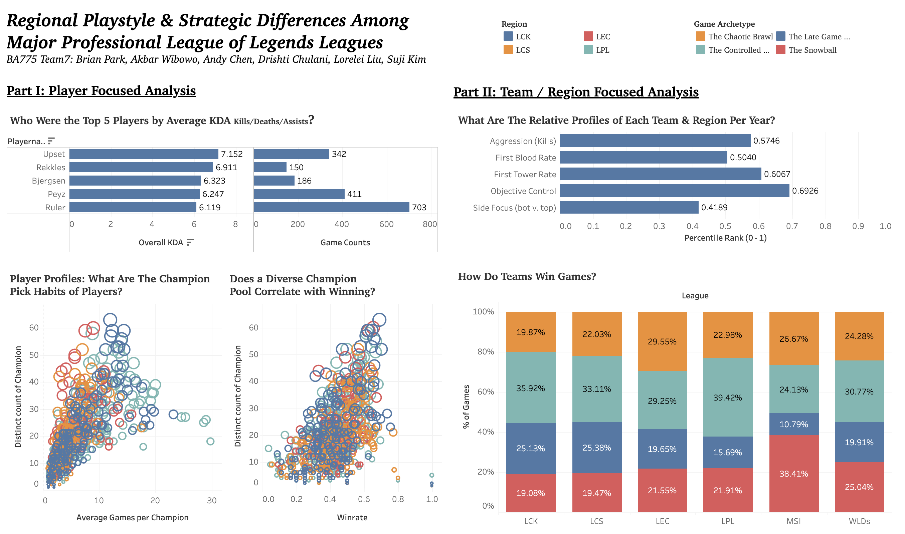
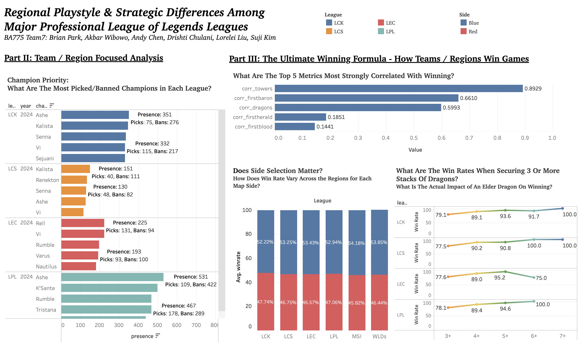

# Playstyle---Strategic-Differences-Among-Major-Professional-LoL-Leagues

**👥 Team Members**
- Brian Park (PM)
- Akbar Wibowo
- Andy Chen
- Drishti Chulani
- Lorelei Liu
- Suji Kim

## **📊 Executive Summary**
This project gives an in-depth analysis of League of Legends professional e-sports while excluding the highly technical information on tempo and advanced drafting strategies indigestible for the average stakeholder. Key findings reveal that players can reach long term success in their careers with diverse champion pools. While truly dominant teams are characterized by quick snowballing and tower acquisition, most wins are secured through controlled and efficient macro play. According to the insights highlighted, it is recommended for stakeholders to remove the age-curve bias when considering esports athletes, unlike traditional sports, and invest in teams that focus on controlled, known-risk plays and picks in the regular season, with abilities to play out of their comfort zone in elimination tournaments and playoffs.

## 📈 Key Visualizations

### 1️⃣ Tableau Dashboard 1
 

### 2️⃣ Tableau Dashboard 2

